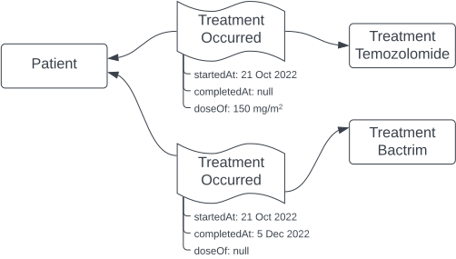
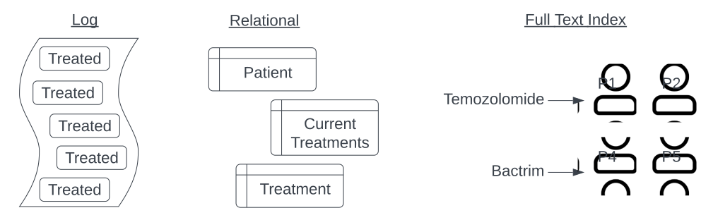

Navio's architecture is driven by a business need to keep time-based data forever.

<!--more-->

Navio is a health tehnology company making apps that let cancer patients better understand and stay on track their care.  Over time, Navio collects valuable insights into how these patients are doing and what is working well for them.  This information ultimately allows pharmaceutical and diagnostic companies improve care for everyone.

early architecture choices tend to be durable

From experiences prior to Navio, I had observed that **early architecture choices tend to be durable**: once you've started with a tool or strategy, overcoming its inertia is very challenging. If you start off with a [big ball of mud](http://www.laputan.org/mud/mud.html), that's likely where you'll remain. So, some modest time invested in early thought about the eventual system organization and code structure can pay dividends later, even if you don't necessarily get there all at once.

To that end, a key early insight we had was that the data we collect is inherently time-based. Medical care is highly episodic: it occurs at specific but disconnected points in time. Our knowledge of this care is similarly fragmented or fractured. It's not enough, for instance, to keep track of what medicines a patient is currently supposed to be taking, but we must also know how their prescriptions and adherence to taking these drugs have changed over time. [Better example: adherence graph or reference to separate article?] In short, **where we've been is as important as where we are.**  This river of time-based knowledge is a core part of the value we provide and must be kept forever.  

Because of this, we architected Navio's core platform with time in mind: as an event-based system. 

Specifically, in Navio's architecture we think primarily in terms of "Events".  An Event in this context is **a statement of something that was true** about the world at a point in time. Events are often defined in the past tense: `TreatmentPrescribed`, `MedicineTaken`, `TaskCompleted`, etc.  As such, events are immutable and unchanging: they were true at the point in time where they were collected. If our understanding changes in the future, we'll record more events. Sometimes we'll have to resolve conflicting or contradictory events.

Simply put, rather than modeling current relationships:

We instead store statements about what was true at the time:

We can then expand or "denormalize" the events into the current state where needed, in different formats to suit the needs of the particular sub-system:

an immutable log of events is the core data structure and source of truth in our system

An event-based architecture, then, is one then passes events around as the core way of communicating between different parts of the system. Going further, an [Event Sourcing](https://martinfowler.com/eaaDev/EventSourcing.html) system uses **a log of events as the core data structure and source of truth in our system**.  This log is durable and immutable.  

In our system, each user or client application has a separate webapp in a backend-for-frontend style.  These separate applications mostly communicate changes via asynchronous events on the event log.  We use [Apache Kafka](https://kafka.apache.org/) to store this immutable log durably.  We're not dogmatic, a handful of services use REST where strong transactional guarantees are required, such as for the atomic creation of a unique patient.  

Each app or service also keeps a local state store, typically in postgres, but Elasticsearch and Redis are also used by some services.  The local state store can be thought of as a projection or cache of the relevant parts of the event stream, and can be completely reconstructed from it.  The app receives events from Kafka, applies them to the local database and then emits events in response to the incoming events, or based on user actions.  User actions don't immediately impact database state, but instead are emitted as events and immediately consumed by both local and remote applications.  Local database transactions are used to maintain a consistent view of the events that have been consumed from Kafka.  By introducing this separation between user input and recording outcome, we force all of the important interactions into the message log where other apps can consume and react to this input.  Having distinct applications for each type of user also helps force a complete and consistent log.

all important interactions are forced into the message log where other apps can consume and react to them

I should note: these are not new ideas. See the reference section at the end of the article for some suggested reading.  Indeed, we did a lot of reading when designing this system.  Some of the key objections we heard about event-sourced systems were:

* **Complexity**, because the system is more complex than a traditional [CRUD](https://en.wikipedia.org/wiki/Create,_read,_update_and_delete) model, and requires more code to handle the event interactions.  So we wrote a library, "Cronkite," that encapsulates much of this complexity and guides towards consistent coding patterns.
* **Verbosity**, in that every single change to the system must be enacted by some event, leading to a proliferation of tiny events. Our library automatically creates and applies "technical events" that have simple impacts on data models.  More complex "business events" are handled via hand written code.
* **Duplicativeness**, since the different parts of the system that share data must separately implement similar or the same data models. We again work hard to reduce boiler-plate so that the essential differences between the various similar models are apparent.

It's also important to note that we did not implement this architectural at once: At first, we stored the log of events in a postgres table and then gradually introduced Kafka and refined our approach over time.

[diagram incremental implementation?]

I don't suggest that this architecture is appropriate for all situations.  It does have a number of advantages, but also introduces significant complexities. 

**Advantages**

* **Democratized Data:** Teams can consume from the central log independently.  Also teams can organize around customers rather than around data.  A team can efficiently spin ups  new app or service, for instance by starting with only the most recent events and then progressively adding older data. 
* **Awesomely auditable**: Every event carries provenance information about who created it and when, which eases responding to requests to justify or explain a particular oddity.
* **Asynchronous and resilient:** Each part of the system (such as those serving different kinds of users) is decoupled from the other so they can continue to operate independently in case of a failure.
* **Sized and shaped**: Different services or apps can have different organizations of data or can pick and choose the subset of events they are actually interested in.
* **Easily debugged**: Having the complete history and not just the current state vastly simplifies answering the inevitable question "how could this state possibly have arisen?!" We also keep a local database table in each app of the events we've received, so we can investigate issues where one app's interpretation of the event stream differs from others.

**Challenges**

* **Asynchronous and eventually consistent**: Asynchronicity enables resilience but it also means that not all parts of the system are in sync.  Care must be taken to design events that constrain the impact of dependencies between events and and user interfaces  that set appropriate expectations of recency and up-to-dateness.

* **Data is forever**: Once written, event data cannot be retracted as later events may depend on them.  We ended up with several different "angry little" events that we had to work around. This durability also complicates GDPR compliance and the right to be forgotten.  It's important to give yourself tools to handle this, whether  encrypting data for later shredding, reprocessing 

  We are also at work on tools to allow carefully controlled rewriting of history when absolutely necessary.

* **Kafka's (a) Beast**: We ran into several issues with Kafka itself that required several rounds of problem-solving. In particular, it's difficult to precisely clone Kafka topics due to how Kafka implements transactions.  Also, Kafka has several different timeouts it's important to be aware of an tune appropriately.

We'll discuss several of these issues in later posts.

TODO: lessons learned

#### Follow on technical articles we plan to write:

* API design: success around reducing boilerplate but at the expense of some "magic."
* Kafka offsets and cloning practicum: how we overcame some essential challenges in Kafka's transactional implementation.
* Ordered consumption and migrations (Viktor): our approach to eventual consistency and how we temporarily enforce ordering at key moments, such as when migrations span topics.
* Schemas: the importance of forward-compatibility in event-sourced systems, and some work we've done to help ourselves maintain this property as our event schemas evolve.
* Debuggability: use a recent error as an example of how 
* GDPR and right to be forgotten: topic compaction and  crypto shredding.
* Build a toy event sourcing system in python?

#### References:

* Kleppmann, [Designing Data-Intensive Applications](https://www.oreilly.com/library/view/designing-data-intensive-applications/9781491903063/). A tour de force explication of application architectures.
  * See also Kleppman's excellent talk "[Thinking in Events](https://martin.kleppmann.com/2021/07/02/debs-keynote-thinking-in-events.html)"

* [Data on the Outside, Data on the Inside](https://www.cidrdb.org/cidr2005/papers/P12.pdf)  
* Stopford, **[Designing Event-driven Systems](https://www.oreilly.com/library/view/designing-event-driven-systems/9781492038252/#toc-start)**. Very useful conceptually but also obviously a marketing tool for Confluent. 
* Kleppman, [**Designing Data Intensive Applications**](https://www.amazon.com/Designing-Data-Intensive-Applications-Reliable-Maintainable/dp/1449373321). Excellent strategic introduction to system architecture.
* Newman, [**Building Microservices**](https://www.amazon.com/Building-Microservices-Designing-Fine-Grained-Systems/dp/1491950358/ref=pd_sbs_14_t_0/131-9244616-6912759?_encoding=UTF8&pd_rd_i=1491950358&pd_rd_r=0fbcd440-1861-453d-a13f-2b6c8ccf484f&pd_rd_w=2Ont6&pd_rd_wg=e0nBL&pf_rd_p=5cfcfe89-300f-47d2-b1ad-a4e27203a02a&pf_rd_r=KCFK2GAZJEP3CCP2GR4V&psc=1&refRID=KCFK2GAZJEP3CCP2GR4V). Much more tactical and a bit dated but still a good collection of things to think about.
* Rocha, **[What they don't tell you about event sourcing](https://medium.com/@hugo.oliveira.rocha/what-they-dont-tell-you-about-event-sourcing-6afc23c69e9a)**.  Discusses key pitfalls. 

