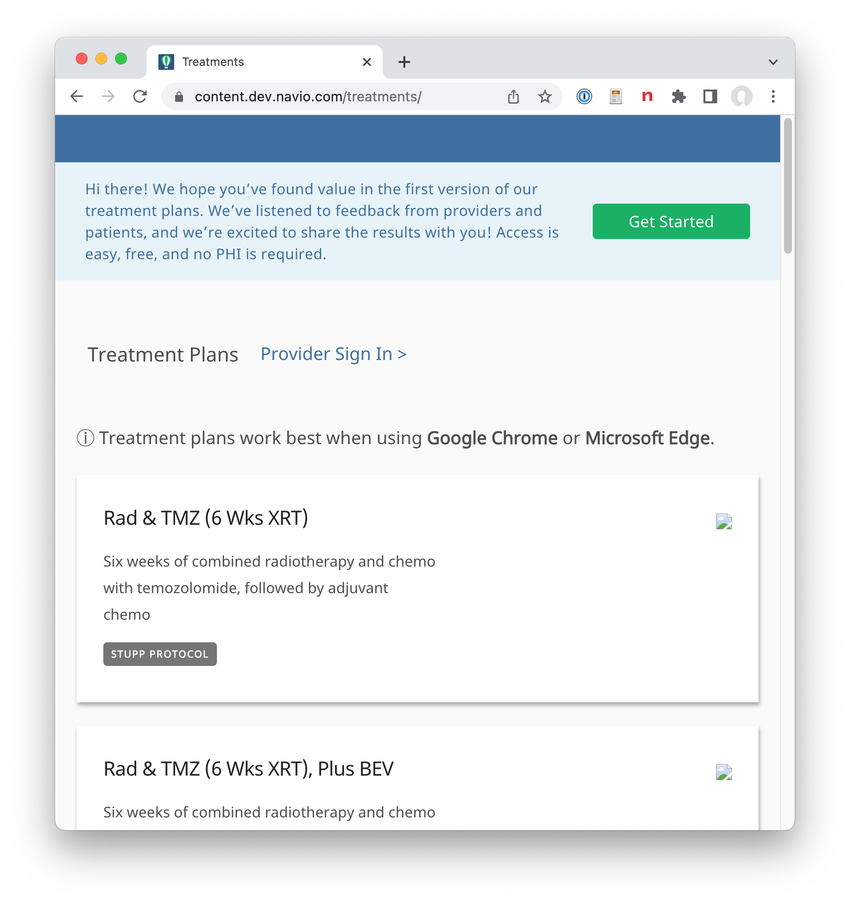

<!--more-->

> Goals of this article:
>
> * How to proceed when your market and customer needs are unclear or confused: experiment.
> * What's necessary to successfully experiment:
>   * A set of axes or variables to experiment along.
>   * A platform that has the right mix of technical capability and approachability
>   * Enough of the "must haves" to allow your customers to even talk to you.
> * What are some examples of experiments that Navio performed? (What were their outcomes?)
> * What technical capabilities allowed Navio to perform these experiments?
>   * Configuration as data / configuration tools like authoring
>   * Content / authoring environments like wordpress and content builder
>   * A robust data model that could be easily extended to accommodate the concepts needed for the experiment.
>
> Take aways/lessons learned:
>
> If the system is too rigid: it can't flex enough to allow for experiments, it will only do what you designed it to do.
>
> If every experiment requires some engineer to do significant work, then they're not really experiments they're features that you aren't sure will "stick."  That's not to say that engineering can't be involved: product managers might say "I just need this one thing and then I can do this range of experiments."
>
> Just because you successfully complete experiments doesn't mean people will buy your product.
>


<div class="pull-quote-right"><span class="quote">"Value given is value received"</span></div>

Navio began as an idea. Like all good ideas, it felt good in the mind.  The idea was simple: the best way to help patients is to get them to help themselves.  All the other participants in our healthcare system – the doctors, nurses, administrators – are maxed out. Their attention is "Manhattan real estate:" [1] it's taken already.  By providing valuable tools directly to cancer patients, we could activate the last remaining "latent capacity" in the modern healthcare system: patients themselves. 

In talking to oncologists and nurse navigators we learned that, while care has gotten more sophisticated and complex, patients are often on their own to understand and navigate that care. We saw an opportunity to provide simple tools that meet patients where they are and provide the right help at the right time:

* Reminding patients of their treatment schedule as it varies in cycles over time.  
* Preparing them for in person appointments such as MRIs and bloodwork.
* Helping patients take their oral chemotherapy on time, so it is consistent in bloodstream for maximum effect.
* Addressing symptoms before they snowball and delay treatment: such as helping them understand that taking  Zofran before chemo prevents nausea.

It seemed crazy how simple the challenges are and how little consumer technology has been applied to addressing them.  By providing this help and gaining their trust, we could then learn about what's actually working in their care and what's less useful. We suspected this information would be valuable: that pharma companies and diagnostic companies and doctors themselves would ask us to tell them how their own drugs and tests and treatments were working in the real world.

[Visuals?]

However, this idea wasn't a product.  In order to be a product, it had to be bought by someone, and we didn't know who that would be.  We did know for certain that patients wouldn't be buying.  We knew that, until we had enough data – or enough patients – pharma wouldn't be interested.

So, our users were not our customers.  This was challenging.  It meant that our product development was like a lever held too close to its fulcrum: unwieldy, ill-constrained. 

...The feedback we receive was biased and disconnected from commercial value....

 It meant we needed to experiment.  Moreover, we had to experiment not just to find market fit, but to find a market at all.

Having operated in healthcare for decades, the team knew there were several challenges we would face immediately 
that we needed to explore in order to learn about the inherent tradeoffs.  We thought of these as "axes" that we needed to experiment across:

* General vs customized: how accurate and specific to a particular treatment protocol does our app need to be; does more specificity actually help or cause problems?
* Personal vs compliant: when in the sales cycle can we get the necessary approvals to gain access to patients vs having tools that don't need specific patient information?
  * Source of patients: our own vs providers.
  
* Manual vs automated?  


How could we set ourselves up to be successful in this experimentation

* A set of users be they patients, nurse navigators, oncologists, caregivers etc.
* A feedback loop to collect learnings from those users.
* A platform for "hosting" the experiments that balances people capabilities and technical capabilities.  
* All of the crap that you just have to have to sell into healthcare.

On that last point, product features tend to break down into three categories [REFERENCE]:

* Stuff that users use every day, that is the core capability of the product
* Stuff that makes your users smile, that delights them.
* Stuff you just have to have for users to even talk to you, that's required or mandated.


Some examples of experiments:

We heard repeatedly during our early conversations with doctors and nurses that brain cancer patients struggled to keep on top of their treatment schedule, especially at the onset of treatment, after having often debilitating brain surgery.  Providers were manually creating calendars using Google Calendar, Outlook and Excel, and either sharing these online or printing them out.  These calendars quickly grew out of date, and took enormous effort to create and keep updated.

[Some quotes from Nurse Navigators about calendars?]

*An example calendar for a lung cancer patient from the Cleveland Clinic.*

We built an initial experiment that allowed generation of a patient-specific calendar from a template for a particular treatment protocol or "plan."  This tool combined a Wordpress list of plans with a proof-of-concept calendar engine called "iCalrumba" and used an open source Javascript calendar rendered to display and allow printing of the calendar.

[Can we find any screenshots of the early calendar tool?]



Originally, the calendar templates were hand edited [YAML](https://en.wikipedia.org/wiki/YAML) files checked into our code repository:

```
  - id: a063f384-0322-4adb-973a-c26e6d21cf54
    name: Start Radiation
    category: MILESTONE
    description: >-
      Treatment phase of radiation + your prescribed dose of Temozolomide for 6 weeks.
    start:
      type: CONCURRENT
      relativeToEventId: efc414ef-8c0e-4eef-84f3-df5d436f24fb
      relativeToOccurrence: FIRST
    duration:
      type: ALL_DAY
# etc etc etc
```

This initial version was rough. It didn't support any options beyond 

It was a completely un-logged-in experience, nothing was saved or persisted.  It took days to hand-edit the template for a new calendar.  But! It allowed us to give something to healthcare providers and **get their feedback on it**.

From these initial experiments, we learned that, while the basic elements (drugs, overall timing) of standard cancer care is similar across institutions there are many subtle but meaningful variations.  In other words, standard of care is not so standard.  For instance, the [Stupp protocol](https://radiopaedia.org/articles/stupp-protocol-for-glioblastoma?lang=us) is the standard for initial treatment for brain cancer (Glioblastoma), and combines radiation treatments with a chemotherapy drug, Temozolomide or TMZ.


However, about half of patients take their chemotherapy at night before bed and half take it in the morning before radiation treatment.  It turns out that [taking it in the morning](https://medicine.wustl.edu/news/chemo-for-glioblastoma-may-work-better-in-morning-than-evening/) seems modestly but noticeably better.

<div class="pull-quote-right"><span class="quote">Standard of care is not so standard.</span></div>

Because of this variability, our product managers routinely fielded requests from nurse navigators to customize ourcalendars with additional details of the patient's schedule. 

* "We don't recommend fasting"- Oncologist
* ""We recommend anti-nausea med 1 hour (not 30 min) prior to chemo."- Oncologist
* "We have 3 different antibiotics that we choose from." - Oncologist
* "we do ask them to book-end the XRT with TMZ..." - Oncologist
* "I’m noticing that bedtime is automatically put at 10 pm. I’m guessing there may be a way to change this in the future?" - Nurse
* “It’s like a recipe for a cake, everyone has their own recipe but they all make a great cake. Each endocrinologist has a little bit of a different protocol… you might look it up but how do you adjust to match?” - Nurse Navigator
* "You have to be completely accurate" - Nurse Navigator

We added features to our calendar tool that let providers choose from a variety of "layers" (by analogy to those in Photoshop or other graphics tools) with differing options to customize the plan to their institutions specific practices.  However, managing this set of options in YAML quickly grew unwieldy.  So, we built a visual "authoring" environment that allowed our product managers to create and adjust "care plans" that include the calendar template as well as patient outreach schedule and educational content.  Indeed the bulk of Navio's patient experience is represented as data.

Here you can see in our authoring tool a "layer" that is shared among 5 plans:


You can see a preview of the resulting calendar in the middle of screen.

This tool allowed us to quickly build customized calendars for existing users and even demo plans specific to the potential customer we were preparing to demo to.  Moreover, it allowed our internal team to *experiment*.  For example, one of product managers built this set of variant plans in just a few hours:

*    Adjuvant Chemo (5/23)
*    Adjuvant Chemo (5/23) Cottage
*    Adjuvant Chemo (5/23), Plus QOL
*    Adjuvant Chemo (5/23), Plus Side Effects
*    Adjuvant Chemo (5/23) Spanish
*    Adjuvant Chemo Plus Hydroxyurea (5/28)

Fielding the requests for these more complex schedules pushed on our underlying scheduling engine.  We added features like:

* Repeating events: take chemo every day at 9am.
* Events that depended on another event (take anti-nausea 2 hours before chemo even if chemo moves.)
* Cycles: Repeat Chemo for 28 days and then take a 2 week break.
* Alternating (A/B) cycling: MRI every other cycle.
* Rescheduling selected events: patient can change their bloodwork appointment time but not their radiation. 


[What were we doing while we were making these experiments? What was timing?]

[What outcome from this experiment? What evidence?]  [I can't really find any quotes about feedback on our increased specificity.]

It was clear that the specificity of these calendars was critical to their value.  By 

In summary, this calendaring tool, and the sophisticated scheduling engine it relied on formed the core capability of our product, the "stuff used every day."

[Need]


Unfortunately, it's not enough to be valuable.  There's a certain amount of stuff you just have to have for 

For example, 

Before providers can give us 

An advantage of this tool was that it didn't require the collection of Protected Health Information (PHI) from our providers.  For providers to give us patient information like name and phone number required a complicated set of agreements to get signed between Navio and the hospital and that, since the providers themselves were not the customers, took significant time and effort.  

However, because we didn't have any contactinformation for patients, we couldn't communicate directly with them.

We built a HIPAA-compliant version of our app that allowed providers to enter patient phone number, to which we would text a web app URL with an interactive version of their treatment calendar.


Technical win?

[Ultimately, we failed to get any providers to actually use this tool for their patients, not because they didn't like the tool but because of the ponderous legal process to gain access to PHI.]

"General Access"


[How to get to clinical trials?   How to get to delight? ]

Medication adherence?  Paper checklists?  Link to navio blog?  Reproduce figures.


> 100% of participants in an eight week study said that Navio’s texts helped them remember to take their medications, and 92% said that navio’s checklist helped them remember that they were taken

https://www.navio.com/post/the-importance-of-an-individualized-approach-to-adherence

Our own patients vs those of healthcare providers

Offline tools like printable calendars and medication checklists.

Also experimented with devices.

Metabase


Medical records?

Use of box


Technical experimentation?  I think this is a separate article


What were the technical choices we made that let us experiment?

* A solid data model.
* A [flexible architecture](../posts/2022-12-29-event_arch): 
* A mix of developed (calendar engine) and off-the shelf tools (wordpress, meta base)


Lessons learned

What we did well:

* A solid platform to experiment with that took care of the shoulds and the musts.
* Actual experiments. Could always have done more.  
* Talking to core users (patients and nurses) and responding to their feedback.

What we did poorly: 

* Understanding how big the gap is in larger healthcare institutions between the champions of your product and the decision makers.
* Talking to buyers / signers of checks
* Navigating the huge gap between "that's interesting" and "I'll buy."
* Runway: we knew the sales cycle would be long but just how long amazed us.  Over 1.5 years to go from a first discussion about a clinical trial to launching that trial on our software.  We just didn't give ourselves enough time. Pandemic didn't help, but it wasn't the only thing going on.  This stuff just takes forever.  ("Have a meeting to recall what the last meeting was about.")
* Efficiency:


When I talk to others or read about  https://news.ycombinator.com/item?id=34287685

"It's not like we didn't know."

Ultimately, Navio's story is still being written.


[1] Jon Brown