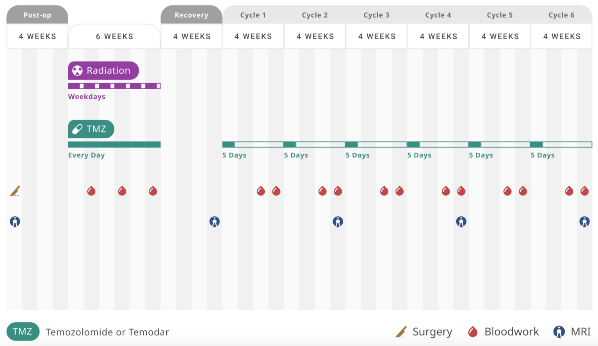
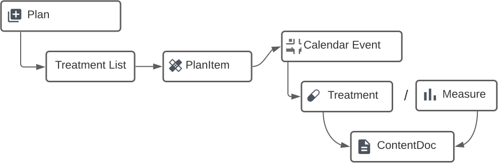

A carefully planned platform enabled Navio to experiment around difficult tradeoffs between customers and users.

<!--more-->

> [Omit this from final version: ]
>
> Goals of this article:
>
> * How to proceed when your market and customer needs are unclear or confused: experiment.
> * What's necessary to successfully experiment:
>   * A set of axes or variables to experiment along.
>   * A platform that has the right mix of technical capability and approachability
>   * Enough of the "must haves" to allow your customers to even talk to you.
> * What are some examples of experiments that Navio performed? (What were their outcomes?)
> * What technical capabilities allowed Navio to perform these experiments?
>   * Configuration as data / configuration tools like authoring
>   * Content / authoring environments like wordpress and content builder
>   * A robust data model that could be easily extended to accommodate the concepts needed for the experiment.
>
> Take aways/lessons learned:
>
> If the system is too rigid: it can't flex enough to allow for experiments, it will only do what you designed it to do.
>
> If every experiment requires some engineer to do significant work, then they're not really experiments they're features that you aren't sure will "stick."  That's not to say that engineering can't be involved: product managers might say "I just need this one thing and then I can do this range of experiments."
>
> Just because you successfully complete experiments doesn't mean people will buy your product.
>


Navio began as an idea. Like many ideas, it felt good in the mind.  The idea was simple: **the best way to help patients is to help them to help themselves**.  All the other participants in our healthcare system – the doctors, nurses, administrators – are maxed out. As our head of product Jon likes to say, their attention is "Manhattan real estate:" it's taken already.  By providing valuable tools directly to cancer patients, we could activate the last remaining "latent capacity" in the modern healthcare system: patients themselves. 

In talking to brain cancer oncologists and nurse navigators we learned that, while care has gotten more sophisticated and complex, patients are often left on their own to understand and navigate that care. We saw an opportunity to provide simple tools that meet patients where they are and provide the right help at the right time:

* Reminding patients of their treatment schedule as it varies in cycles over time.  
* Preparing them for in person appointments such as MRIs and bloodwork.
* Helping patients take their oral chemotherapy on time, so it is consistent in bloodstream for maximum effect.
* Addressing symptoms before they snowball and delay treatment.

<div class="pull-quote-right"><span class="quote">Value given is value received.</span></div>

It seemed crazy how simple the challenges are and how infrequently consumer technology has been applied to helping patients.  Moreover, by providing this help and gaining their trust, we could then learn about what's actually working in their care and what's less useful. We suspected this information would be valuable: that pharma companies and diagnostic companies and doctors themselves would pay us to tell them how their own drugs and tests and treatments were working in the real world.  Importantly, we would **gain value** (real world data) **by** **giving value** (tools for patients): value given would be returned in value received.


However, this idea wasn't a product.  In order to be a product, it had to be bought by someone, and we didn't know who that would be.  We did know for certain that patients wouldn't be buying.  We also knew that, until we had enough data – or enough patients – pharma wouldn't be interested.

So, our users (patients, their caregivers, nurses, doctors) were not our customers (hospital administrators, pharmaceutical and diagnostic executives).  This was challenging.  It meant that **our product development was like a lever held too close to its fulcrum**: unwieldy, ill-constrained.  The feedback we would get was disconnected: it would help us improve the product, but wouldn't help us actually sell it.  It meant we needed to experiment even more.  Moreover, we had to experiment not just to find market fit, but to find a market at all.

Having operated in healthcare for decades, the team knew there were several challenging "axes" that we needed to experiment across to find the right balance:

* **General vs customized:** how accurate and specific to a particular treatment protocol does our app need to be; does more specificity actually help or cause problems?
* **Personal vs compliant:** when in the sales cycle can we get the necessary approvals to gain access to patients vs having tools that don't need specific patient information?
* **Future value vs immediate ease of use:** how much burden should we put on our users now to collect information we might hate ourselves for not having later?

So, we knew we needed to experiment, and we had identified a few key variables to experiment around.  How could we set ourselves up to be successful in this experimentation? We needed:

* A set of users be they patients, nurse navigators, oncologists, caregivers etc.
* A feedback loop to collect learnings from those users.
* A platform for "hosting" the experiments that balances people capabilities and technical capabilities.  [Data model]
* All of the crap that you just have to have to sell into healthcare.

On that last point, product features tend to break down into three categories: 

* stuff that users use every day, that is the core capability of the product, 
* stuff that makes your users smile, that delights them, and 
* stuff you just have to have for users to even talk to you, that's required or mandated.  [REFERENCE? Turn this into figure?]


Some of the experiments we performed included:

* Creating calendars for patients,
* Allowing providers to "taste" Navio's calendars without entering protected health information,
* Tracking patient adherence to oral chemotherapy medications,
* Adjusting the specificity of our treatment calendars,
* Reducing the burden of creating these specific calendars.

We'll describe each of these experiments below.


### Core calendaring capability

Initially, we thought the core capability and key value we'd provide patients would be education: helping them understand and get "onboarded" to their treatment.  However, while this tested well with patients, it didn't resonate with providers who thought they had sufficient tools for education.

Instead we heard repeatedly during our early conversations with doctors and nurses that brain cancer patients struggled to keep on top of their treatment schedule, especially at the onset of treatment, after having often debilitating brain surgery.  Nurses were manually creating calendars using Google Calendar and Excel, and either sharing these online or printing them out.  These calendars quickly grew out of date, and nurses spent enormous effort to create and keep updated.  Moreover, Google Calendar and Excel are not designed for the regulations of a healthcare setting, and provider's sanctioned Electronic Health Record software doesn't help patients understand their treatment (rather it helps doctors get paid).

We heard things like:

> Please fix our calendar problem.  <span class="attrib">– Oncologist</span>

> We use Google Calendars to manage patients. Don’t say that to anyone because we don’t know if it’s ok to do.  <span class="attrib">– Oncologist</span>

*An example calendar for a lung cancer patient from the Cleveland Clinic.*

We quickly built an initial experiment that allowed generation of a patient-specific calendar from a template for a particular treatment regime or "plan."  This tool combined a Wordpress list of plans with a proof-of-concept calendar engine called "iCalrumba" and used an open source Javascript calendar widget to display and allow printing of the calendar.


This initial experiment, while rough and ready, allowed us to give something of value to healthcare providers and patients and **get their feedback on it**:

> I think this is an amazing idea.  <span class="attrib">– Nurse Practitioner</span>

> Thank you! This is helpful. We were second guessing ourselves... it’s overwhelming and a lot to take in at the beginning. <span class="attrib"> – Brain cancer caregiver</span>

> Thank you. No one told me anything about the anti-nausea timing before chemo. Just said to 'play with what works'. <span class="attrib">– Brain cancer patient</span>


As a part of these initial experiments, we learned that, while the basic elements (drugs, overall timing) of standard cancer care are similar across institutions, there are many subtle but meaningful variations.  In other words, standard of care is not so standard.  For instance, the [Stupp protocol](https://radiopaedia.org/articles/stupp-protocol-for-glioblastoma?lang=us) is the standard for initial treatment for brain cancer (Glioblastoma), and combines radiation treatments with a chemotherapy drug, Temozolomide or TMZ.

*Navio's cartoon diagram of the Stupp protocol, used as a patient instruction aid by oncologists.*


<div class="pull-quote-right"><span class="quote">Standard of care is not so standard.</span></div>

Even though this is a standard treatment protocol, we found that providers vary in when they administer the chemotherapy: half of patients are told to take their TMZ chemotherapy at night before bed and half to take it in the morning before radiation treatment.  It turns out that others later discovered that [taking it in the morning](https://medicine.wustl.edu/news/chemo-for-glioblastoma-may-work-better-in-morning-than-evening/) seems modestly but noticeably better.  This was exactly the kind of learning opportunity we had hoped to discover!  

From this experiment, we had identified a **core capability for our product: helping nurses and providers make calendars for their patients, and had learned something key: that small details of treatment matter**.  


### Agreements and Access

After this initial experiment, we thought it was obvious that we should allow providers to share these calendars electronically with patients. In order to maximize the value to and from the patient, we wanted to remind patients of their events and collect information about their progress. So, we added this calendaring capability into our patient app (originally focused more on patient education), allowed providers to enter patients name and phone number, and texted patients a link to their calendar.  This resulted in a workflow like the following:


But, there was one catch: we had to get doctors to feel comfortable telling us about their patients.  For providers to give us patient information like name and phone number required a complicated set of agreements (a "BAA") to get signed between Navio and the hospital and that, since **the providers themselves were not the customers**, took significant time and effort to obtain.

It wasn't so much that the providers didn't trust us, or feel we couldn't safely keep this information.  Because it was on our list of *stuff you just have to do*, we had designed our app to be [HIPAA](https://en.wikipedia.org/wiki/Health_Insurance_Portability_and_Accountability_Act) compliant from the very beginning and indeed we passed several security reviews from major institutions with flying colors.  Despite this, doctors and nurses felt they had to get permission from their hospital administrators and health-system executives or even had uncertainty about who to approach to gain such permission:

> With that information, I'll need to go back and talk to our executive director and practice management people.     <span class="attrib">– Oncologist</span>

> I'm not sure what the guide-rails are with HIPAA. <span class="attrib">– Nurse Navigator</span>

Navio's need to have information about patients conflicted with provider's uncertainty about sharing Protected Health information.  We heard from providers that they would need to "wait for a BAA."  **We waited, and waited and waited**, sometimes for up to a year to get this permission, if it ever came.  This caused us to loose momentum in our sales process, because providers would be interested in using our tools after our initial sales pitch, but discussions would stall while appropriate permissions were obtained.

To resolve this, we engineered in a simple role-based access system with two classes of provider users: one who can enter and view PHI and one who cannot.  Our provider data model made this relatively trivial because we had designed it around the idea of "capabilities" that we could assemble into roles as needed:

```kotlin
interface ProviderCapabilityContext {
    fun canSeePatient(patientId: UUID): Boolean
    fun canSeeTreatmentPlan(treatmentPlan: TreatmentPlan): Boolean
    fun canEnroll(): Boolean // Drives “Share” without PHI 
                             //   vs “Assign to Patient” with PHI.
    fun canSeePhi():Boolean  // Drives ability to see patient list.
    fun shouldSeePromoContent() // Drives visibility of promotional “ads”.
    ...
}
```

 The resulting experience allowed providers to "taste" and use Navio without needing to sign agreements:


but allowed us to easily transition providers to our PHI-full experience once those agreements were signed:


[Quote from Justin Jordan about being lower friction or something?]

We learned that we had to make a **trade-off between getting the traction we needed** in the near term with provider users **vs collecting the** **information we wanted** to achieve our longer term goals with pharma and diagnostic customers.  This was a difficult choice, and in hindsight I'm not sure we always decided correctly.  Indeed, we had to make similar choices throughout the product: whether to prioritize a simpler, more streamlined experience or to ask providers to bear some burden (like entering a date of diagnosis or a medical record number) where the benefit might not be immediate.

One area where we felt that we might be able to provide enough value to justify the collection of valuable information was in medication adherence.

### Allowing for Adherence

We had heard from providers that adherence to oral chemotherapy was a problem for their patients. Patients often simply forgot to take their life-saving medication. Indeed, non-adherence can cost hundreds of thousands of dollars per patient ([ref](https://www.nacds.org/pdfs/pr/2011/PrinciplesOfHealthcare.pdf)), and rates of adherence to oral chemotherapy can be as low as 50% ([ref](https://www.ncbi.nlm.nih.gov/pubmed/29358417;)).  See an article by our product manager Stephanie about the [challenges of medication adherence](https://www.navio.com/post/adherence-simple-solutions-for-successful-care) and one about Navio's [personalized adherence efforts](https://www.navio.com/post/the-importance-of-an-individualized-approach-to-adherence).

Providers asked us:

> Can patients interact with the calendar? It would be great if there were check boxes next to each task within the calendar that the patient can click. <span class="attrib">– Nurse Practitioner</span>

We experimented with printable paper checklists before added medication adherence capabilities to patient app:


While we worked to design and run a clinical study, we ran our own internal experiment to investigate how such a medication reminder tool might help.  Stephanie recruited more than 20 participants, from Facebook groups she was a part of, friends, and Navio staff.  She enrolled each participant in one of several plans that let them configure a number of medication reminders at specific times of day.  Participants received timely text reminders and could come to the app to check off their medications. Stephanie monitored compliance and also sent surveys asking about the impact of the tool.  Overall, participants perceived significant benefit: 100% of participants in the first eight weeks of the study said that Navio’s texts helped them remember to take their medications, and 92% said that Navio’s checklist helped them remember that they were taken.


In order to more deeply analyze the data and share learnings, we installed [Metabase](https://www.metabase.com/), a open-source dashboarding and business-intelligence tool, and connected it to our product database. We were able to quickly spot a number of interesting trends.  For example, this participant clearly had much more trouble checking off meds in the morning than in the evening:


We also observed that patients rate of compliance got better over time. Here is shown a cumulative sum of the difference between scheduled time and taken time, where you can see that, although the are some slips later on, the curves become flatter as the study proceeded.  This likely indicates patients become more compliant, perhaps because the app helped them get into a routine:


This trend is confirmed in the qualitative survey data, for instance, one participant noted:

>  After a few weeks of getting continuous reminders, it’s become a habit and easier to remember.

Clearly, participants perceived value in tracking their medications and were willing to **give us information** (data about medication adherence and timing) in **exchange for this value**.  It was also clear that recruiting our own participants, while perhaps less clinically stringent, allowed us to **start learning immediately**, **rather than waiting for someone else's permission** to approach and enroll their patients.  

The reality is that medication adherence is a crowded marketplace with a variety of apps (like [MediSafe](https://apps.apple.com/us/app/medisafe-medication-management/id573916946)) and hardware devices (ranging from consumer-friendly electronic pill boxes like [EllieGrid](https://elliegrid.com/) to more research-oriented bottle caps like [Pillsy](https://www.pillsy.com/) and expensive but highly effective dispensers like [Hero](https://herohealth.com/)).  Whether adherence is a viable feature for Navio remains to be seen, particularly in clinical trials.  


### Burden of specificity

>  Getting to a real time adjustable calendar would be wonderful.  <span class="attrib">– Oncologist</span>

Because of the variability of treatment schedules across institutions, our product managers routinely fielded requests from nurse navigators to customize our calendars with additional details of the patient's schedule: 


Fielding these requests for more complex calendars pushed on our underlying scheduling engine.  We added features like:

* **Optional layers:** turn on and off optional parts of treatment and choose specific meds (like antibiotics).
* **Rescheduling selected events:** patient can change their bedtime but not their radiation appointment.
* **Confirmations:** ask patient if their schedule is still accurate.
* **Textual notes:** allow providers to add patient-specific messages to calendar.
* **Repeating calendar events:** take chemo every day at 9am.
* **Event dependencies:** take anti-nausea 2 hours before chemo even if chemo moves.)
* **Cycles:** chemo is delivered on a repeating 2 week schedule.
* **Alternating (A/B) cycling:** an MRI is performed every other cycle.


In one experiment, we added features to our calendar tool that let providers choose from a variety of "layers" (by analogy to those in Photoshop or other graphics tools) with differing options to customize the plan to their institutions specific practices.  This took some of the burden off of us of having to create distinct plans for each provider's variants of treatment plans: we could make fewer, more general plans.  The layers are presented to providers as options they can choose when configuring a calendar for a patient:


In addition to the modest variability of plans across practices, we also noticed many of the same "patterns" of events across differing treatment plans.  For instance, the same preparatory information and notifications for MRIs or bloodwork often applies across multiple different protocols.  We experimented with using this same sharing concept to allow those "cassettes" or packages of events, notifications etc, to be re-used where appropriate.  

We were able to perform these kinds of experiments because our application data model was designed from the beginning to accommodate additional features and variable content.  Indeed the bulk of Navio's patient experience is represented as data in our system, not code.  



This is perhaps a complementary corollary to the common [YAGNI](https://en.wikipedia.org/wiki/You_aren%27t_gonna_need_it) principle of not implementing things until you need them: that some modest thought now into how the system might grow can pay dividends later. Questions like: "will there ever be two of these?" or "what are other things like [that]?" can be helpful.  Indeed, while our data model grew more complex, we didn't have to rework very much to accommodate this additional complexity.


Here's a rough diagram of one of our Adjuvant Chemotherapy plans:


Providers really appreciated the specificity and flexibility:

> In terms of adding additional events to the calendar, flexibility around blood work and MRIs, office visits. Anything else that feels limiting?
>
> No, ... it’s really cool. 
>
> <span class="attrib">– Nurse Navigator</span>

>  This will be super helpful for patients... This is the future 
>  <span class="attrib">– Neurooncologist</span>


Through this series of additions and small experiments, we learned that **specificity matters even if it's hard work**.  It's tempting to think that we could make much more general plans or push some of the burden onto providers. The sheer number of requests we got for customization at least suggests that a lot of the value we're providing is in the details.


### Authoring

We did however face operational challenges in creating and maintaining these detailed plans.  Originally, the calendar templates were hand edited [YAML](https://en.wikipedia.org/wiki/YAML) text files checked into our code repository:

```yaml
  - id: a063f384-0322-4adb-973a-c26e6d21cf54
    name: Start Radiation
    category: MILESTONE
    description: >-
      Treatment phase of radiation + your prescribed dose of Temozolomide for 6 weeks.
    start:
      type: CONCURRENT
      relativeToEventId: efc414ef-8c0e-4eef-84f3-df5d436f24fb
      relativeToOccurrence: FIRST
    duration:
      type: ALL_DAY
# etc etc etc
```

It took days to hand-edit the template for even simple calendars.  Managing the new set of options providers demanded by editing YAML quickly grew from unwieldy and error prone to hair-raising and nigh impossible.

To reduce errors and keep ourselves sane, we built a visual "authoring" environment that allowed our product managers to create and edit these care plans, including the calendar templates as well as patient outreach schedule and educational content.  Here you can see in our authoring tool a layer that is shared among 5 plans:


This authoring environment allowed us to quickly build customized calendars for existing users and even demo plans specific to the potential customer we were preparing to demo to.  Moreover, it allowed our internal team to *experiment*.  For example, our product manager Jordan built a set of variant plans in just a few hours:

*    Adjuvant Chemo, Institution X
*    Adjuvant Chemo), Plus QOL
*    Adjuvant Chemo, Plus Side Effects
*    Adjuvant Chemo, Spanish
*    Adjuvant Chemo Plus Hydroxyurea

 This despite the fact that the authoring environment was relatively difficult to use, directly exposing much of the data model of our application (though way easier than editing YAML).  Indeed, a significant fraction of our non-engineering staff became at least familiar enough to make edits to existing plans if not create plans themselves.  

A key question in any discussion of a new feature became: how with this be authored into our plans?  Over time, more and more of our patient experience became editable via this tool and we started to replace other parts of the content building experience, like Wordpress, with our own software.  It was a fair amount of work to make and support these tools, and at times felt like it was taking work away from feature development.  Over time, though, we began to talk about (if not necessarily think about) our platform as a kind of "**low code" tool for creating tailored patient experiences**.


### Technical Support

What were the technical choices we made that let us experiment?

* A well-thought-out data model that could grow over time.
* A [flexible architecture](../posts/2022-12-29-event_arch) and the ability to rapidly deploy in [testing environments](../talks/20220427_sandboxes).
* A mix of developed capabilities (calendar engine, authoring tool) and off-the shelf tools (Wordpress, Metabase).
* An understanding of the technical capabilities of our own staff.
* Over time, our own growing platform of capabilities and features we could use as the basis of our own experiments.

In cases where we we were less sure what the product needs should be, we relied on proven tech to enable user-facing experiments. In other cases, for example around HIPAA or event architecture, our clear knowledge of the product or regulatory requirements allowed us to experiment technically.  While this article has focused on product-level experimentation, we plan a series of posts about some of the more technical experiments our engineering team performed.


### Lessons Learned

What we did well:

* Building a solid platform to experiment on that took care of the shoulds and the musts.
* Designing a truly gorgeous and approachable patient experience, with empathy and intention by [Erin](https://www.erintozour.com/).
* Performing actual experiments that brought significantly valuable learnings and then iterating on them. 
* Meeting and talking to core users (patients and nurses) and responding to their feedback.  
* Sourcing our own users instead of always relying on permission to obtain access from others.

What we did poorly: 

* **Sourcing customers vs users:** really understanding who is our actual customer, the specific decision making person or role, vs the many different kinds of users.  Talking to those buyers / signers of checks to understand what will make them buy (or prevent them from buying) and navigating the huge gap between "that's interesting" and "I'll buy."
* **Efficiency:** making good use of our engineering resources on specific features that resulted in sales vs general capabilities.  While we good use of open source and third party tools, I don't think we were alway as spartan, particularly in infrastructure, as we could have been.
* **Runway:** we knew the sales cycle would be long but just how long amazed us.  Over 1.5 years to go from a first discussion about a clinical trial to launching that trial on our software.  We just didn't give ourselves enough time. Pandemic didn't help, but it wasn't the only thing going on.  This stuff just takes forever.  ("Have a meeting to recall what the last meeting was about.")

When I talk to others or read about how to [sell to large businesses](https://news.ycombinator.com/item?id=34287685), I recognize that a lot of these seem like obvious mistakes.  In our defense, it's "not like we didn't know" many of these things, we just didn't do as good a job as we could have on surmounting them.  Ultimately, Navio's story is still being written and I'm excited to see how we're able to overcome these challenges.


[Where do these diagrams fit, if anywhere?]


