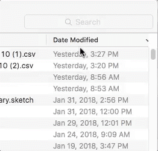
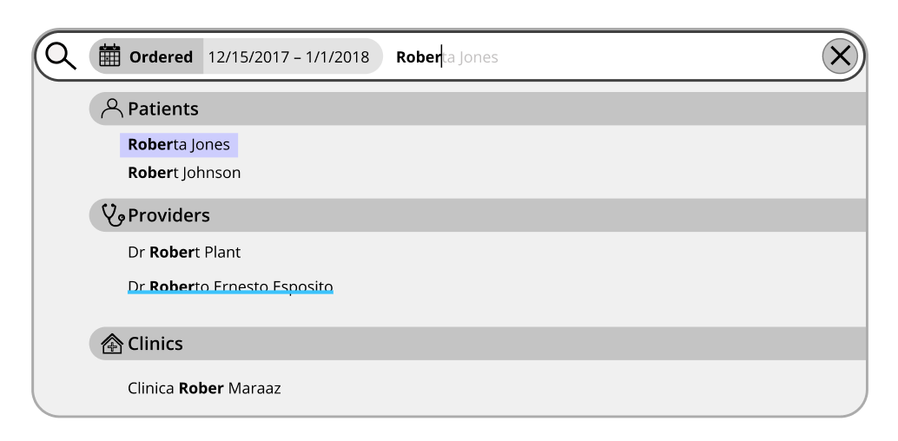
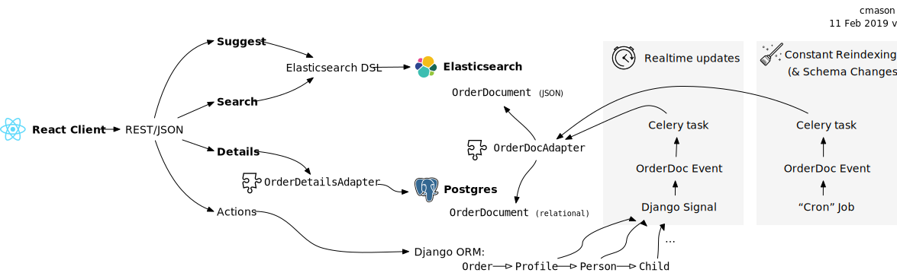
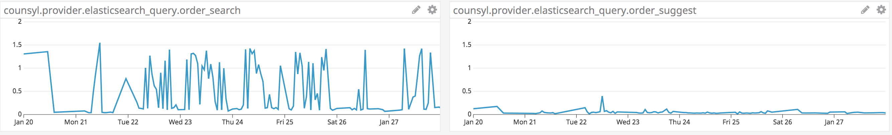

Starting in winter of 2017/2018, I helped lead a small team to develop and launch a new healthcare provider portal for Counsyl (now Myriad).  

<!--more-->

### Making space

The new portal was very much a team effort, across product management, user experience, and engineering, both back and front end. 

Before we could begin however, we had to create space for ourselves to work.  Of all the projects I've worked on, this was among the hardest to make the case for.  To the team, it was obvious that the old portal was not so good.  We'd wanted badly and for many years to reimagine this part of our site.  However, the old portal, to many, was good enough.  We had to make a **solid business case** for why this channel, responsible for about 15% of overall orders, was worth devoting significant effort to.  In particular we drew on analytics and interviews that indicated that many of our most important customers used our portal as an **escape hatch** when more automated processes (such as our workflow tools and EHR integrations) broke down.

### The existing portal

Not to dwell on it, but our old portal was well, old.  In fact, it was among the oldest actively used code on our site.  It was unattractive, slow, and difficult to use.

*Not beautiful, but it worked.*

Our old portal was developed very rapidly, early in the company's lifetime, by one of our founders.  It was, at its core, a bastardization of one of the most productive parts of our web framework, Django, namely its ability to **autogenerate administrative views directly from the database schema**.  We used this functionality extensively to easily enable internal users, like Customer Service agents, to have read and edits views for orders, results, etc that were always up-to-date with our latest schema changes.  So why not also use it to present these same objects to external users as well?

Moreover, its original structure derived from the fact that our first (and, then, only) product was a **carrier screen**, which reports the risk that a child might inherit genetic disorder from both parents.  The portal therefore operated not on individual orders, but *couples*, which were internally called `Child`ren, as they represented the risk to a hypothetical future fetus. Later products were bolted into this scheme.

Even worse, the admin made direct use of our primary database representation, and therefore had to perform a long series of joins (`Child` to `Parent` to `Profile` to ...) before it could, for instance, filter by result severity (eg, `Positive Pregnancy at Risk`).  This made many operations slow, as we'll see below.

In short, while expedient early in our evolution, we had clearly outlived our current architecture.

### Understanding what our customers were experiencing

We began by talking to current heavy users of the existing portal and enumerating all the ways the current portal was not serving them.  We knew from tracking data that the **order list and search features** were the most utilized by far, so we started there.

* Search by patient name was **limited to exact match**, meaning that misspellings or changing last names frustrated users:
    > I wish we could just type in the patient name. It has to be perfect. **If we make one mistake** it will look like we didn’t test the patient

* **Filtering options were confusing**, and as a result, seldom used.  Providers complained about the lack of filtering even though those options were present, just hard to find:
    > It would be great if we could **just see the doctors we care about**.

* Median search **response times were in the ~10 second** range 😱. 
    
    Response times were so bad that providers often performed other tasks while waiting for the portal to load; according to one provider:
    > If a provider calls about a patient, I make small talk while searching for a patient record or **I go make a cup of coffee** while it’s working.

    Another commented:
    > Now that I think about it, the search takes a really long time. It can take a few minutes. At first I thought I did something wrong, but then I learned that it’s just how long it takes to find the patient.

It was obvious from these conversations that we needed a new way to index and search for patient records that was more performant and better organized.

Order placement was the second most common action, but its complexity led us to save it for a v2.  

### Prioritize most critical use cases for user testing

We proposed to focus on the most important features for a new order list view, focusing on making our search and filtering functionality much more usable and performant:

* **Fuzzy matching**: ability to find patients even with misspellings
* **[Faceted search](https://stackoverflow.com/questions/5321595/what-is-faceted-search/5374688#5374688) and filtering**: quickly narrow down to a particular subset of patients.
* **Autosuggest**: when a particular patient record is needed, go directly there if possible.

Because we had the existing portal to fall back on, we could focus on the key value adds that would delight users, rather than having to aim for immediate parity.  

A particular design challenge was how to combine full text search and filtering in the UX.  Our first designs had separate affordances for filtering and full text search, and providers were confused when results didn't appear as expected. In interviews, we discovered that users often had enabled filters during earlier parts of the search process and forgotten about them, but they were now filtering out valuable results.

I was able to suggest a different approach, shamelessly stolen from Apple's Finder:

 that combined both facet and full text search capabilities in a single text box:

This approach tested much better and was retained for the final product.

### Design drives architecture and prototyping

From these design requirements it was clear that some full text search ([inverted index](https://en.wikipedia.org/wiki/Inverted_index)) capability was needed.  We considered and prototyped at least four possible architectures, 

* Continue to use the existing, complicated `Child/Parent/Order/Result` models and somehow speed them up.  Given the amount of effort we'd already expended, significant wins seemed unlikely.
* Denormalize but remain in relational tables and index particular columns using Postgres's [Full Text Search](https://www.postgresql.org/docs/current/textsearch.html) (FTS)
* Use Postgres's JSONB type and index selected JSON path expressions with FTS.
* Use [Elasticsearch](https://www.elastic.co/enterprise-search), a document store based on the full text search engine [Lucene](https://en.wikipedia.org/wiki/Apache_Lucene).

We were big fans and users of Postgres, and had hoped to keep using it for this project.  We were surprised, however, by the difficulty in getting it to perform consistently.  Through careful optimization, we were able to get queries that could perform full text search on small single digit millions of patient records in tens of milliseconds.  However, slight changes to the query, such as the introduction of additional filters, would dramatically and unpredictably alter the query plan, resulting in much poorer performance of hundreds of milliseconds or even seconds.

introducing a new technology carries risk but can be the best way to achieve design goals

With Elasticsearch, however, we always saw consistent query performance, often sub 10-millisecond.  I'm sure there are ways that we could have improved the performance of each of the alternate solutions but the fact that we just didn't have to try very hard was very compelling.  Introducing a new technology into the stack carries risk and requires effort, but sometimes it's the best way to achieve design goals.

### Resulting architecture

Search and suggest requests were routed directly to Elasticsearch and its results list directly displayed in the UI without requiring any relational queries. When the user accessed the details view, however, the page was built from the relational database using existing, well tested queries.  This meant that only the data required for search and filtering had to be populated into Elasticsearch, reducing the size of the index.  This split architecture also served as an important check on the recency and correctness of the Elasticsearch index: our testers could verify by comparing the search results from the index to details page from the relational tables.

A key implementation challenge was to determine, in a large Django codebase that had evolved over many years with no strong type information and inconsistent boundaries, all the places where order information could be modified, so the Elasticsearch index could be correctly updated.  We used Django signals emitted from every modification code path to trigger reindexing in real time as order information was updated.

important to engineer in correctness double checks and affordances for testability

In addition, we introduced a continuous reindexing process that constantly produced a new Elasticsearch index in the background (while the previous index continued to be updated and used to serve query results).  A complete reindexing might take most of a day, but having this background process that worked from the live order data allowed us to compare the resulting record to that already in the index, to detect any inconsistencies.  Typically, these indicated missed updates, which, once discovered, were usually simple to find and address via additional signals.

In a project that adds to an already complex system, it's often important to engineer in correctness double checks and affordances for testability.

### Performance success

Full filtering and search queries took less than a second while suggest queries for specific patients could be accomplished in tens of milliseconds actual response time:

